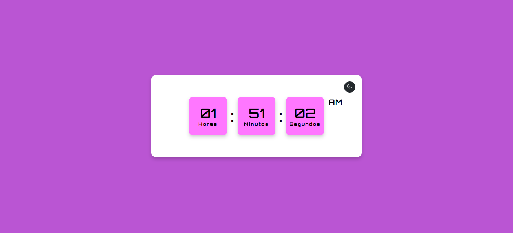
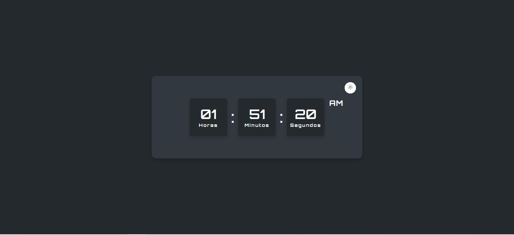

# RELOGIO_DIGITAL

### ⏲️ Relógio Digital

   

### ⏲️ Relógio Digital - Dark

   

## 💻 Projeto

Esse é um projeto de relógio digital, usando JavaScript.

Projeto para estudo. Créditos à [@coding.stella](https://bento.me/codingstella)

## 🚀 Tecnologias

Esse projeto foi criado e desenvolvido pela @coding.stella, usando as seguintes tecnologias:

-HTML

-CSS

-GIT

-GITHUB

-JAVASCRIPT
